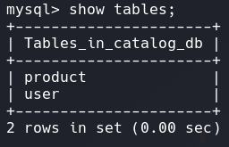
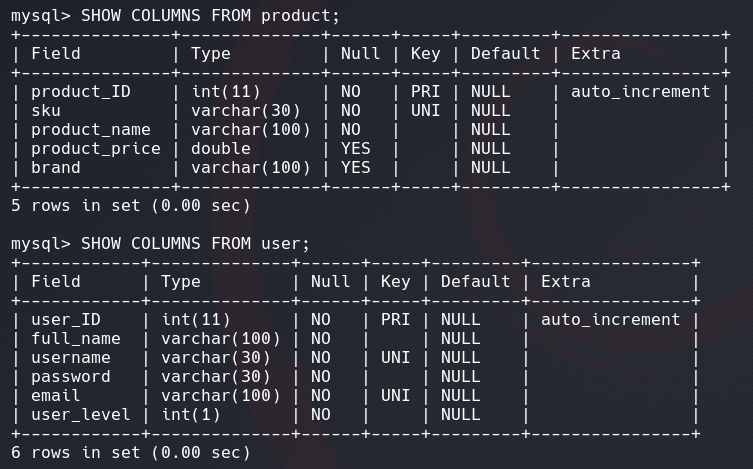
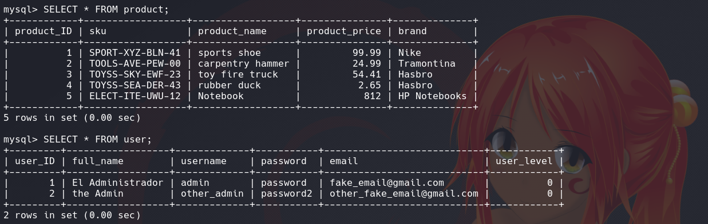
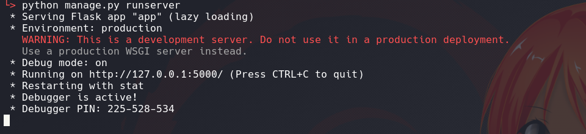

# The catalog (*unfinished*)
This is a catalog API to consult the products it offers

This is a flask project of CRUD product and users
this is a flask project where I implemented a CRUD of users and products through an API, there are two types of Admin users who can use CRUD completely and an anonymous user who can only get the products information.

## Start project

This project is written in python3, you can install python with this [site](https://www.python.org/).

below the examples that I will show were made in the OS GNU/linux. but there are not many differences when starting the program.

### enviromemnt 
to run the project in a local environment we are going to use python virtualenv tool, it is available in Python, first we will locate ourselves in the project folder:
```bash
git clone https://github.com/Samuelpaz95/product_catalog_api.git
cd product_catalog_api
```
and we create the virtual environment
```sh
python -m venv env
```
```sh
# or
python3 -m venv env # if you have python2 installed for default
```
```sh
# or
python3.x -m venv env # if you have an alternate installation of python 3
```
For activate the env run:
```sh
source env/bin/activate
```

### Libraries and dependencies
we are going to install the libraries that we are going to use for this project.
run:
```sh
pip install -r requirements.txt
```
if when executing this command you have an error about mysqlclient, the most probable thing is that you do not have this dependency installed "libmysqlclient-dev"
For install it on Debian, Ubuntu or derivatives run:
```sh
sudo apt install libmysqlclient-dev
```
### Database
For this step you need install MySQL, the program needs a connection to a database to work.

In the folder "database" there are 3 SQL files to create the database and the tables that the API will use to make the queries and insert some test data.

run these files with a database root user, for example:
```sh
# create databes
mysql -u root -p < database/create_database.sql
```
Create a database called "catalog_db" and two users, one with the permission to do SELECT, INSERT, UPDATE, DELETE and another that can only do SELECT
```sh
mysql -u root -p < database/create_tables.sql
```
Create the necessary tables that the API will use



```sh
mysql -u root -p < database/data_filling.sql
```
insert some records to be able to query them from the API



### Run server
we have everything ready, we run the program
run:
```sh
python manage.py runserver
```


View API doc [here](doc/api_doc.md)

## Developers

* **Willy Samuel Paz Colque** - *All*